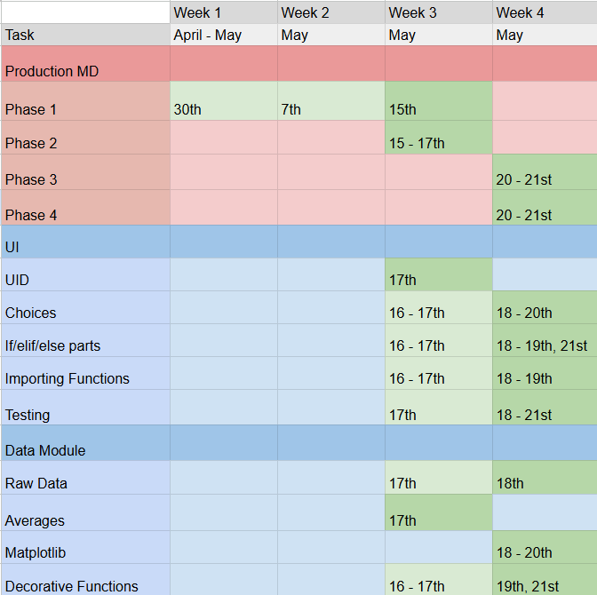

# **Assessment Task 1 2026 - By Rachael MacKinnon**
# **Phase 1 - Identifying and Defining**
## Mindmap

[Miro Mindmap Link!](https://miro.com/app/board/uXjVHdK6NuQ=/?share_link_id=179304639963)

## Defining My Purpose
### Hypothesis: *Students in Gosford High are LESS LIKELY to view the ADF along with Enlistment in a positive light*

## Requirement Outline
### Functional Requirements
>Data Loading: It should be able to load CSV files into data frames while also handling errors or invalid input in a way that doesn't crash the program. The program should also be able to open charts and graphs without any issues or missing images/pieces of data within the files.

> Data Cleaning: Though there shouldn't be any missing values of data (due to it coming from a survey and being manually typed in), however if there are missing values the program should be able to skip over that row of the data set to prevent errors. The program should also be able to filter out information the user doesn't wish to see and be able to group specific columns the user does wish to see.

> Data Analysis: The program should have the ability to display the mean for two responses in order to summarise the data shown.

> Data Visualisation: The data will be displayed with panda dataframes along with matplotlib pie charts and bar graphs.

> Data Reporting: The system should output charts that contribute to answering the original question in a way that allows users to visualise the data. The system should also be able to calculate averages from the dataset and display the raw data itself. There should also be a UI for the user to interact with in order to make a successful program. In order to do all of the above, I will need Pandas for data display, Matplotlib for charts, and a CSV file for the data containment.

### Non-Functional Requirements
> Usability: The UI should offer multiple choices for the user to choose from, while also being labelled in a way that clearly lets the user know what they are actually selecting (E.g. instead of a choice being [See Graph], it should instead be [Data Visualisation of Survey Outcomes]). On top of this, the README should...

> Reliability: The system should be able to register invalid responses and instead output an [INVALID: PLEASE TRY AGAIN] message for the user. This should prevent most errors, however, should other errors appear, a try/except OR if/elif/ekse code will run to register any outputs or inputs that could cause issues, presenting a different error code, [ERROR: SYSTEM MALFUNCTION, PLEASE TRY AGAIN]. In regards to data integrity, the system should be able to present the collected data as is, whether the form differs, the core data should remain accurate and consistent throughout the system. This data is also collected through public survey, so averages should be properly calculated through python functions, again remaining consistent with the original data. In regards to the viewable raw data, it should be complete and discernible for users to view and compare to the summarised displays. On top of all this, the responses from the actual google form will not be displayed with names, but the correlating order in submition to ensure privacy for those responding as well, ensuring data integrity for users. Within the actual interface itself, user names will not be stored, and all variables related to it will be cleared and reset once the program ends.

### Use-Case
>  
    Actor: User

    Goal: To have the capability to view data in a way that will give the user a clear answer or response to the defined hypothesis just by interacting with the system/UI and accessing the data within.

    Preconditions:

    - The data from the survey is already preloaded onto a CSV file within the repository, and turned into graphs, dataframes, and calculated averages

    - The user is able to access the system through forking a github repository, allowing them to access the data within through cloning it through Github Desktop (therefore the user must have access to Github along with Github Desktop)

    Main Flow:
    User runs the main.py code and enters in their UID

    User views/sees the user interface along with all the choices/options

    User chooses one of the 5 different options with different outcomes:
    1. View Raw Data
        a) Import pandas dataframe and present it to the user
    2. View Data Visualisation: How people see Enlistment (1-10)
        a) View as a Pie chart
        b) View as a Bar chart
        c) View both Charts
        d) Exit sub-program
    3. View Data Visualisation: Main reason people would Enlist
        a) View as a Pie chart
        b) View as a Bar chart
        c) View both Charts
        d) Exit sub-program
    4. View Averages
        a) View Averages for thoughts on Enlistment? (Choices were on a scale of 1-10)
        b) View Averages for thoughts on Enlisting for Housing? (Choices were made on a scale of 1-5)
        c) View Averages for thoughts on Enlisting for Employment? (Choices were made on a scale of 1-5)
        d) View Averages for thoughts on Enlisting for Eduucation? (Choices were made on a scale of 1-5)
        e) View Averages for thoughts on Enlisting for Civil Duty? (Choices were made on a scale of 1-5)
        f) View all Averages
        g) Exit sub-program
    5. Exit

    System runs code based on what the user chose to do, including sub-selection. Whether that be importing/presenting data frames, opening/presenting graphs or charts, calculating averages for all outcomes/choices, and closing/ending the loop or program.

    Postconditions:

    - User has viewed and/or interacted with the data.

    Any valid updates are saved by the system.

    Data remains available for further queries or analysis.

# **Phase 2 - Researching and Planning**
## Researching my Chosen Issue
> ### Due to the lack of information online related to the hypothesis, only 3 websites are listed below:

> ### https://www.abs.gov.au/articles/australian-defence-force-service
> ### https://theforge.defence.gov.au/article/deep-dive-our-tiny-recruitment-pool
> ### https://generationsurvey.org.au/data_story/young-australians-aspire-to-join-the-defence-force/?utm_source=copilot.com

## Discussing my Findings - SEEC/L
> ### In regards to the overall information retrieved from the websites listed, a common point I've found is the fact that only a very small minority of the population actually serve in the army. You see, when refering to enlistment, there are actually 2 major parts. The first is choosing to enlist (signing up for the army), and the second is being actually chosen to be a part of the ADF. When seeing if a young person is eligible to serve, the ADF does have to still see if they meet the criteria (e.g. health, criminal records, etc). These factors make the pool of recruits even smaller for the ADF, subsequently, only 16% of young Australians both meet the criteria to qualify for  the ADF, and actually show the interest to join the military, causing only a minority to serve. 

> ### Leading on from the last paragraph, the majority of people who enlist seem to be university graduates. When looking at the goverment sight abs, we can see that the age that gets the most enlisters is 25-34, the average age where people have graduated from university. The total count in fact, was 21,168 people in 2021, compared to the runnerups (15-24) being 14,710, a full 144% increase in people. This data can allow us to corrolate the fact that people who want to go to the army probably want to get their education out of the way before starting, showing further evidence of university graduates probably being the biggest portion of the ADF. However, following the last paragraph, 21,168 people isnt actually a large number. Australia had 25.4 million people in 2021, meaning that the largest portion in the people enlisting (age wise), doesn't even add up to 1% of the population. This also further shows the fact that the amount of people that enlist are a very small minority overall.

## Aquiring my Data
> ### [GOOGLE FORM!: What are YOUR thoughts on Military?](https://forms.gle/VNycTJ2GhKjxYJcd9)

### The above link is a google form for the students of Gosford High School, filled in by peers across the school community.

## Teenage thoughts on Enlistment -  Data Dictonary
|Field|Datatype|Format for Display|Description|Example|Validation|
|-|-|-|-|-|-|
|Recipient Number|str|X...X|Number representing the responders in the same order the responses come in.|#23|Must have a # in front to discern from the row numbers. Following should be 1-2 numbers.|
|Enlistment Thoughts (1-10)|int|N...N|Scale of 1-10 on how responders view enlistment. 10 being 'AMAZING', 1 being 'HORRIBLE'.|10|Must be a number consisting of 1-2 digits lying on the range 1-10.|
|Enlistment for Housing (1-5)|int|N|Scale of 1-5 on responders thought on enlistig for housing if they were to enlist.|3|Must be a number consisting of 1 digit lying on the range 1-5.|
|Enlistment for Employment (1-5)|int|N|Scale of 1-5 on responders thought on enlistig for emplyment if they were to enlist.|5|Must be a number consisting of 1 digit lying on the range 1-5.|
|Enlistment for Education (1-5)|int|N|Scale of 1-5 on responders thought on enlistig for education if they were to enlist.|2|Must be a number consisting of 1 digit lying on the range 1-5.|
|Enlistment for Civil Duty (1-5)|int|N|Scale of 1-5 on responders thought on enlistig for civil duty if they were to enlist.|4|Must be a number consisting of 1 digit lying on the range 1-5.|
|Highest Rated Section|str|XX...XX|Word/s representing a specific reason someone may enlist that each responder chose|Civil Duty|Must be a word/s that comes from the 4 options given in the form| 

# **Phase 3 - Producing and Implementing**
### PLEASE REFER TO README FILE FOR AN EXPLANATION FOR HOW TO USE THE WEBSITE
> ### [Click here for README](https://github.com/Rlm484/9CT-Task-1/blob/main/README.md)

# **Phase 4 - Testing and Evaluating**
## Testing your Analysis
### [ All testing of the program had a positive outcome without any bugs. All algorithms work correctly and provide accurate responses, corrolating with the CSV. ]

## Analyse and Conclude
### In regards to the overall findings, we have extracted much information from the survey as a whole. These findings include two major discoveries:
> ### Firstly, the highest reason/s for enlistment across all responses was that of Education and Housing. However, this data cannot be called completely accurate. This is due to the raw data extracted from the survey being limited, in other words, there aren't enough responses to create a definite conclusion. Implications of this shows that next time, as the dev, I could make the form a lot earlier, allowing me to collect more data and research. Note however, that this extracted information from the findings isn't directly corrolated with the actual hypothesis, which brings me to my second discovery.

> ### The second discovery is that the average score for enlistment on a scale of 1-10 is 6.57. This means that actually, the hypothesis was null, meaning I was wrong. The data gathered and the information extracted has proved that technically, the general consensus sees enlistment and subsequently, the ADF, in a good/positive way. This outcome is counter-active to the hypothesis proposed, proving a positive outcome, instead of a negative one. This data however, does have it's drawbacks, as in it can't definitively prove how people see the ADF due to the information only displaying thoughts on enlistment. Implications of this can cause me, the dev, to next time add more specific questions that reflect the hypothesis more closely.

## Peer Verification - Written by Avina Venati
|P|M|I|
|-|-|-|
|The options are very clear and detailed|The only drawback would be the speed at which the program outputs the information, it is a little bit slow|Only implication might be to make the output information a bit faster|
|The chosen options output all the correct information and visualisations|||
|Program is not complicated and is very clear to navigate in and around|||
|Every aspect of it works without any errors or misinformation|||
|Topic is also unique|||

## Evaluating your Project
### **Evaluate system in relation to Requirements Outlined**
----
> ### When referring to my functional requirements, the system completes the criteria listed:
> ### Data loads/imports into the program smoothly while also turning it into a dataframe without causing any errors whatsoever. Charts have also provided the same outcome in regard to loading. 
> ### For Data cleaning, there are no missing values, proving the skipping function unneeded for the program itself. On top of this, the UI basically provides filtering for the user in itself, without needing external functions.
> ### Data analysis is achieved through the program accurately displaying the mean of multiple responses and summarising data shown.
> ### Pandas dataframes and matplotlib charts also provide clear interpretative data in a visual way that is easy for the user to understand for data visualisation.
> ### Finally (for functional requiremennts), the program *outputs charts that contrivute to answering the original question in a way that allows users to visualize the data*, calculating averages and displaying all other forms of information. UI works perfectly, and pandas, matplotlib, & the CSV file have all contributed to making a successful program, completing the data reporting requirements.

### When referring to my non-functional requirements, the system also completes the criteria listed:
> ### In corrolation with usability, the UI does offfer multiple choices, being created in a way that allows easy navigation for the user.
> ### For reliability, the system does deal with bugs/errors (e.g. invalid inputs), and elif/if/else has been used to filter errors/bugs. Data integrity is also ensured due to the primary research done, and the systems non-collection/saving of the data inserted for usernames.
----
### **Evalute system in relation to Peer Feedback**
----
### In regards to peer feedback (PMI), the system seems to have receieved positive reviews. User feedback included the fact that the system was easy to use, and provided accuracy in data and charts. System navigation in regards to convenience was also complimented, and no errors or bugs were reported; topic/research the system was based off of was also mentioned as unique for the user.
----
### **Evaluate project in relation to project management**
----
### In relation the the project management for Assessment Task 1: Computing Technology; the time management was pretty poor. Due to my trip to New Zealand in Week 2/3 (weekend), project was delayed. On top of this, another assessment task was due a week before the one submitted, delaying progress further. Eventually, I did get it done, but not in a timely way that would have been a more efficient use of my time.

----
### **Evaluate system in relation to Data and Security**
----
### When viewing my project in regards to it's data and security, I am safe to say that the data is in fact valid, accurate, and relevant to the current generation. This can be proved by the fact of how only DOE students could answer the form, and how it came from real human beings. Linear scales were used to ensure accuracy, and validity is confirmed by the diverse responses. This also means the data is unbiased. Though, yes, as a student myself, I did submit a response of how I thought of enlistment, my response was only a fraction of 39 responses overall, ensuring an overall unbiased outcome. Imporvement of security is also unnessecary, due to the program not storing the names inserted at the beginning of running the program, meaning security is also ensured. The UX however, can be improved. UX could be improved through looping of sub-programs, to make it more convenient for users to view sub-options within the sub-program. 