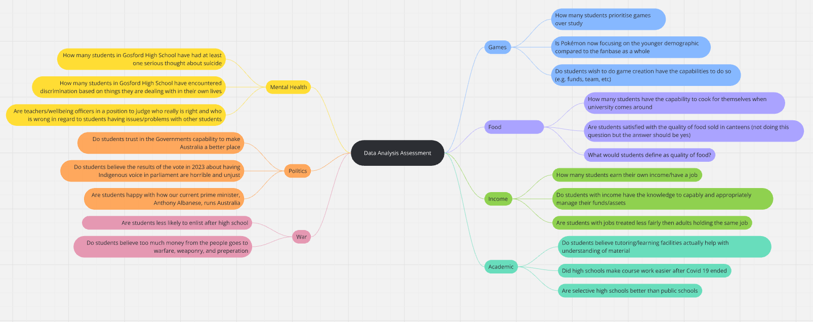

# **Assessment Task 1 2026**
# **Phase 1 - Identifying and Defining**
## Mindmap

[Miro Mindmap Link!](https://miro.com/app/board/uXjVHdK6NuQ=/?share_link_id=179304639963)

## Defining My Purpose
### Hypothesis: *Students are Less Likely to Enlist after High School*
## Requirement Outline
### Functional Requirements
>Data Loading: It should be able to load CSV files into data frames while also handling errors or invalid input in a way that doesn't crash the program. The program should also be able to open charts and graphs without any issues or missing images/pieces of data within the files.

> Data Cleaning: Though there shouldn't be any missing values of data (due to it coming from a survey and being manually typed in), however if there are missing values the program should be able to skip over that row of the data set to prevent errors. The program should also be able to filter out information the user doesn't wish to see and be able to group specific columns the user does wish to see.

> Data Analysis: The program should have the ability to display the mean for two responses in order to summarise the data shown.

> Data Visualisation: The data will be displayed with panda dataframes along with matplotlib pie charts and bar graphs.

> Data Reporting: The system should output charts that contribute to answering the original question in a way that allows users to visualise the data. The system should also be able to calculate averages from the dataset and display the raw data itself. There should also be a UI for the user to interact with in order to make a successful program. In order to do all of the above, I will need Pandas for data display, Matplotlib for charts, and a CSV file for the data containment.
### Non-Functional Requirements
> Usability: The UI should offer multiple choices for the user to choose from, while also being labelled in a way that clearly lets the user know what they are actually selecting (E.g. instead of a choice being [See Graph], it should instead be [Data Visualisation of Survey Outcomes]). On top of this, the README should...

> Reliability: What is required from the system when providing information to the user on errors and ensuring data integrity? The system should be able to register invalid responses and instead output an [INVALID: PLEASE TRY AGAIN] message for the user. This should prevent most errors, however, should other errors appear, a try/except OR if/elif/ekse code will run to register any outputs or inputs that could cause issues, presenting a different error code, [ERROR: SYSTEM MALFUNCTION, PLEASE TRY AGAIN]. In regards to data integrity, the system should be able to present the collected data as is, whether the form differs, the core data should remain accurate and consistent throughout the system. This data is also collected through public survey, so averages should be properly calculated through python functions, again remaining consistent with the original data. In regards to the viewable raw data, it should be complete and discernible for users to view and compare to the summarised displays. On top of all this, no data from the users should be collected, so overall, data integrity is ensured in majority of aspects.
### Use-Case
>  
    Actor: User

    Goal: To have the capability to view data in a way that will give the user a clear answer or response to the defined hypothesis just by interacting with the system/UI and accessing the data within.

    Preconditions:

    - The data from the survey is already preloaded onto a CSV file within the repository, and turned into graphs, dataframes, and calculated averages

    - The user is able to access the system through forking a github repository, allowing them to access the data within through cloning it through Github Desktop (therefore the user must have access to Github along with Github Desktop)

    Main Flow:

    User runs the main.py file and views/sees the user interface along with all the choices/options

    User chooses one of the 5 different options with different outcomes:
    1. View the Data Frame of Raw Data?
        a) Import pandas dataframe and present it to the user
    2. See the Visualisation of whether people wish to enlist?
        a) View as a Pie chart?
        b) View as a Bar chart?
    3. See the Visualisation of why people wish to enlist?
        a) View as a Pie chart?
        b) View as a Bar chart?
    4. View averages of survey outcomes?
        a) View the averages of the Pro-Enlist faction?
        b) View the averages of people's thoughts on enlisting for Housing opportunities (no./5)?
        c) View the averages of people's thoughts on enlisting for Employment opportunities (no./5)?
        d) View the averages of people's thoughts on enlisting for Education opportunities (no./5)?
        e) View the averages of people's thoughts on enlisting for Civil Duty (no./5)?
    5. Exit

    System runs code based on what the user chose to do, including sub-selection. Whether that be importing/presenting data frames, opening/presenting graphs or charts, calculating averages for all outcomes/choices, and closing/ending the loop or program.

    Postconditions:

    - User has viewed and/or interacted with the data.

    Any valid updates are saved by the system.

    Data remains available for further queries or analysis.
# **Phase 2 - Researching and Planning**
## Researching my Chosen Issue
### Due to the lack of information online related to the hypothesis, only 3 websites are listed below:
### https://www.abs.gov.au/articles/australian-defence-force-service
### https://theforge.defence.gov.au/article/deep-dive-our-tiny-recruitment-pool
### https://generationsurvey.org.au/data_story/young-australians-aspire-to-join-the-defence-force/?utm_source=copilot.com
## Discussing my Findings

## Aquiring my Data
> ### [GOOGLE FORM!: What are YOUR thoughts on Military?](https://forms.gle/VNycTJ2GhKjxYJcd9)